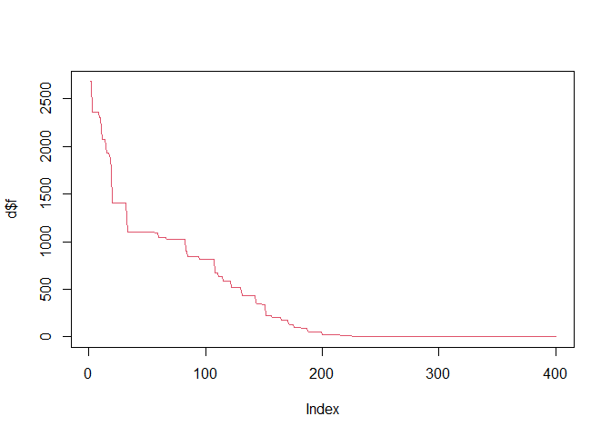
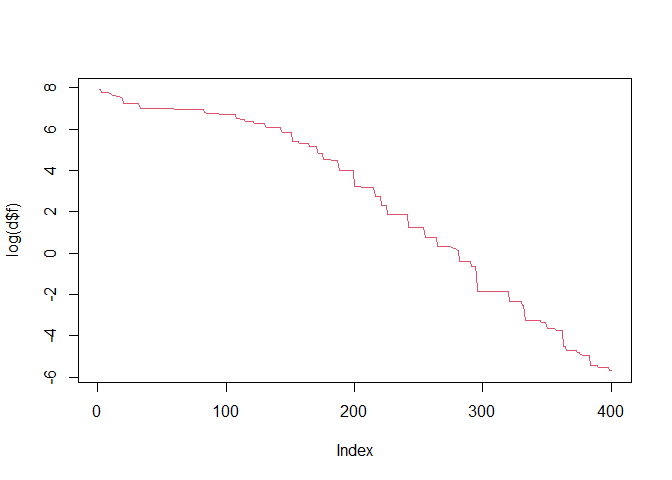

<!-- README.md is generated from README.Rmd. Please edit that file -->

# DEoptimPIC

<!-- badges: start -->
<!-- badges: end -->

DEoptimPIC provides some interesting tools and benchmark functions to
test three different versions of the differential evolution algorithm.
The Differential evolution algorithm is a nature inspired algorithm used
for solving global optimization problems. Often it is also used for
solving not complex constrained optimization problems. This package
proposes the following DE versions:

-   BaseDE: the standard DE algorithm for solving optimization problems,
    provided with 4 mutation strategies
-   MDE: a modified version of the DE that automatically select a
    strategy from a pool of 2 with different probabilities
-   SAmDE: a modified version of the DE that selects, based on a
    probability, the mutation strategy from a pool of 4 strategies

## Installation

You can install the development version from
[GitHub](https://github.com/) with:

``` r
# install.packages("devtools")
devtools::install_github("FilippoPic/DEoptimPIC")
```

## Example

This is a basic example which shows you how to solve a common problem:

``` r
library(DEoptimPIC)
l <- -500
u <- 500
n <- 10
NP <- 40
n_gen <- 400
f <- 0.9
CR <- 0.4
#to perform a standard DE run with strategy DE/rand/1
d <- DEbase(schwefel,l,u,n,NP,n_gen,f,CR,strategy = 1)
```

Now you can see the best value found by the algorithm:

``` r
d$f_best
#> [1] 0.003388758
```

Or see the convergence plot:

``` r
plot(d$f,type='l', col = 2)
```



``` r
plot(log(d$f),type='l',col=2)
```


